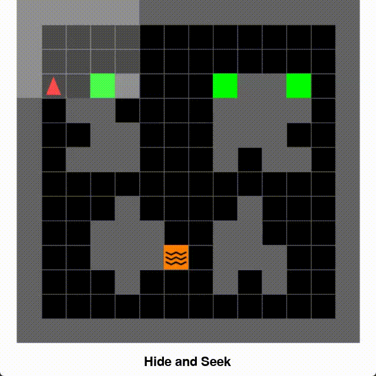
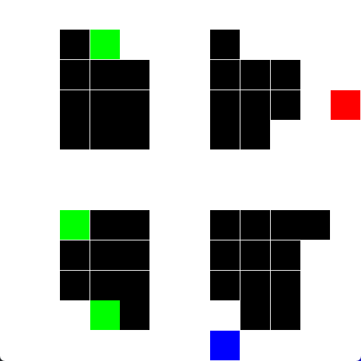
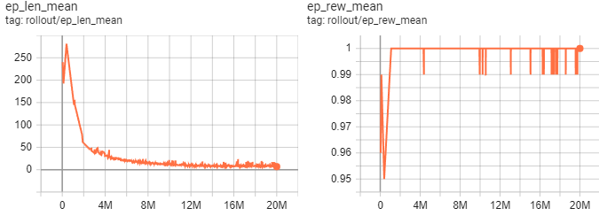
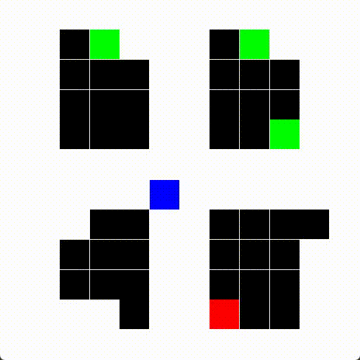
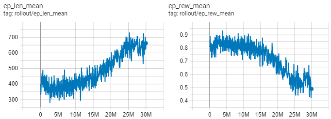
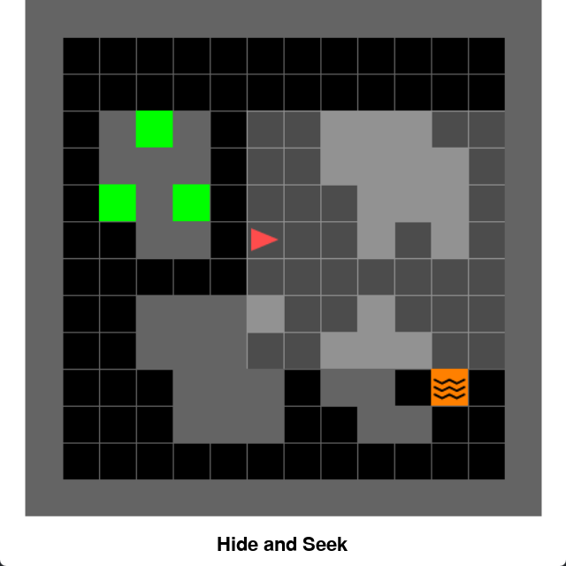
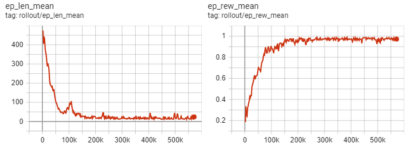
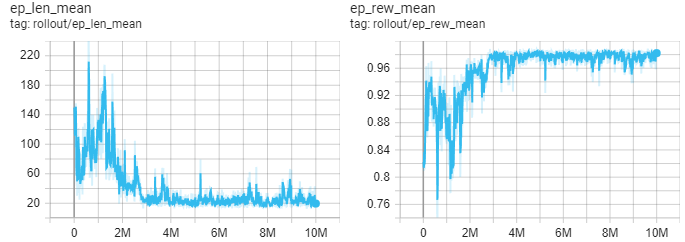

# Project Goal

The purpose of this project is to create an AI by reinforcement learning (using `DQN` in `Stable-Baselines3`) that learns to hide from a player in a 12x12 matrix. The player doesn't move and the player and agent positions are random.  
**Gif of my PPO agent in Minigrid environment (described below in the Readme)**


# Installation

I did not provide a requierement.txt file because installation of CUDA can be messy between different hardware. Simply create a virtual environment and install the following packages.

- `python -m venv .venv`
- `source .venv/bin/activate`
- `pip install 'stable-baselines3[extra]' numpy gymnasium pygame minigrid`

# First strategy: DQN + Gym environment from scratch

To solve this I created a custom `Gymnasium` environment from scratch that represents a 12x12 matrix and trained a DQN model to hide in it.

### Environnement Architecture

- The observation space is a flatten 12x12 matrix, so a 1D vector with 144 values.

```python
self.observation_space = spaces.flatten_space(spaces.Box(low=0, high=4, shape=(MATRIX_SIZE, MATRIX_SIZE), dtype=np.uint8))
```

- Elements are encoded as following in the vector: 0 empty space, 1 AI Agent, 2 Player (guard), 3 Pillars (obstacles), 4 Good Hiding Spot (reward tiles).
- Four actions are possible: moving up, down, left, right.
- Reward function is +1 for moving in a good hiding spot.
- A good hiding spot is defined as a tile that is not in line of sight by the player and that has a least 2 adjacent pillar around it. For each map, only the three most distant good hiding spots from the player are valid rewarding position.
- I used the `DQN` (Deep Q-Learning) algorithm from `Stable-Baseline3` with `MlpPolicy` (flat observations). Other hyperparameters are listed in `train_dqn_*.py` files. The main hyperparameters is the usage of a long exploration period (A decreasing epsilon exploration rate from 1 to 0.05 on 80% of the training time).
- There is a time limit of 1000 steps for each episode.

### Checking the environment

**/!\ Please make sure your computer can open a graphic window for PyGame (typically if using Windows and WSL you will need an X-Serv)**  
To show a sample environment:

```bash
python jumbo_gym.py
```

A PyGame video will open with the agent (blue square), good hiding spots (green square, hidden from the line of sight with the player and has at least two adjacent walls), the guard (Red Square) and obstacles/pillars (black squares).  


### Results on the predefined map

To reproduce the training and evaluate the model. You can skip the training as the models are provided in `models/` folder.

```bash
python train_dqn_determinist_map.py # OPTIONAL Models are pre-computed, might be long
python eval_dqn_model.py.py
```

On the predefined map, the model was trained for 20M time steps. Full Tensorboard graphs are available [here](https://tensorboard.dev/experiment/71F5RvkkRO6lu03eC7y6gg).  
  
The model converged to a good solution, with a mean reward of 1 (success) and a mean episode length of 8 (compared to 250 at the beginning). However it took a long time, training on 20M steps took around 10 hours on a standard hardware (Ryzen 5 CPU + RTX 3060Ti). Results were optimal around 12M time steps. These results are for a single predetermined map, so it might be an issue on random maps.  
**Here is a GIF of the trained DQN model solving my gym environment in a predetermined map setting:**


### Results on the random map

To reproduce the training and evaluate the model. You can skip the training as the models are provided in `models/` folder.

```bash
python train_dqn_determinist_map.py # OPTIONAL Models are pre-computed, might be long
python eval_dqn_model.py.py
```

Full Tensorboard graphs are available [here](https://tensorboard.dev/experiment/71F5RvkkRO6lu03eC7y6gg).  
  
The model struggled to learn from completely random maps. The mean episode length increased over learning time and the reward decrease meaning the model did not learn to solve the environment.

### Perspectives

To solve the issue of random maps I did several modifications that are used in the second strategy part:

- Change from DQN to PPO algorithms as it has shown better performance and shorter wall time in the literature
- Change from my custom gym env to custom Minigrid env (Image environment with partial observation space)
- Change the random map generation function to simplify the environment.

# Second strategy: PPO + Minigrid environnement

In this second strategy, I modified some architecture choice to make a model that can hide in a randomly generated map. All files are located in `PPO_minigrid` folder

### Environnement Architecture

- The new environment is a custom [MiniGrid](https://minigrid.farama.org/index.html) environment. (Check `PPO_minigrid/minigrid_env.py`)
- Environment observation space is an image
- The agent only have a partial observation space (field of view). This might lead to better generalization abilities from the agent (not overlearning the map).
- The reward is 1 for the hiding spot and a small penalty for each time step
- The `PPO` algorithm from `Stable-Baselines` was trained with default parameters for a total of 10 000 000 time steps.
- Random maps are generated by creating between 3 and 4 (random value) rectangular obstacles (random width and height between 3 and 5) at predefined location (Four Corners). Then random squares are removed from the outer layer of these rectangle obstacles to generate hiding spots (between 3 and 5 squares are removed randomly).

### Checking the environment

**/!\ Please make sure your computer can open a graphic window for PyGame (typically if using Windows and WSL you will need an X-Serv)**  
To show a sample environment (you can use keyboard arrows to control the agent):

```bash
cd PPO_minigrid
python minigrid_env.py
```

A PyGame video will open with the agent (red triangle square), good hiding spots (green square, hidden from the line of sight with the player and has at least two adjacent walls), the guard (orange lava square) and obstacles/pillars (gray squares). The highlighted area in front of the agent is his field of view (partial observation space).  


### Results on the predefined map

To reproduce the training and evaluate the model. You can skip the training as the models are provided in `models/` folder.

```bash
python train_ppo_determinist_map.py # OPTIONAL Models are pre-computed, might be long
```

Full Tensorboard graph are available [here](https://tensorboard.dev/experiment/71F5RvkkRO6lu03eC7y6gg).  
  
On the pre-determined map, the model converged very fast to a solution as good as DQN (500k time steps vs 12M for DQN). The mean reward is 0.97 with 18 step for average episode length. These results are not directly comparable to the previous env because there is a reward penalty of episode length and also this agent performs more actions as he as to turn (which count as an action) on itself to move, leading to a slightly overestimated steps to completion.

I don't show GIF of the results because it's very similar to DQN. I was mainly interested in the random map training.

### Results on the Random Map

To reproduce the training and evaluate the model. You can skip the training as the models are provided in `models/` folder.

```bash
python train_ppo_random_map.py # OPTIONAL Models are pre-computed, might be long
python eval_ppo_model.py
```

Full Tensorboard graphs are available [here](https://tensorboard.dev/experiment/71F5RvkkRO6lu03eC7y6gg).  
  
On the random map environment, the model took a longer time to converge but it successfully converged to a good solution, where DQN couldn't. The mean reward is also around 0.98 with a final average episode length of 18.1  
**Training output:**

```
----------------------------------------
| rollout/                |            |
|    ep_len_mean          | 18.1       |
|    ep_rew_mean          | 0.984      |
| time/                   |            |
|    fps                  | 251        |
|    iterations           | 4883       |
|    time_elapsed         | 39807      |
|    total_timesteps      | 10000384   |
| train/                  |            |
|    approx_kl            | 0.13157117 |
|    clip_fraction        | 0.274      |
|    clip_range           | 0.2        |
|    entropy_loss         | -0.245     |
|    explained_variance   | 0.333      |
|    learning_rate        | 0.0003     |
|    loss                 | -0.0778    |
|    n_updates            | 48820      |
|    policy_gradient_loss | 0.0822     |
|    value_loss           | 0.00246    |
----------------------------------------
```

**Here is a GIF of the trained PPO model solving my Minigrid environment in a random map setting (changing every reset):**


# Final Words

To conclude I think I solved the task by using PPO algorithm instead of DQN, in a MiniGrid environment. This AI agent is able to quickly hide from a non-moving player in a randomly generate map.  
Thank you for checking this repo, this was a fun project.  
To contact me: [https://cmeyer.fr](https://cmeyer.fr) / [lambdascience@tutanota.com](mailto:lambdascience@tutanota.com)
