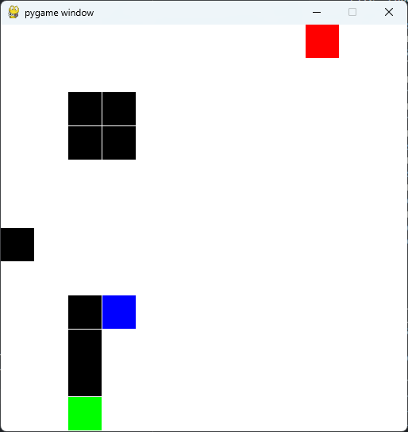
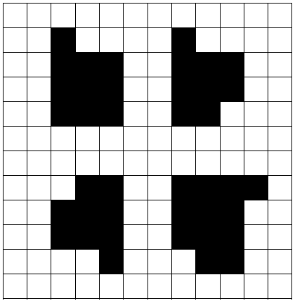

# Goal

The purpose of this exercise is to create an AI dedicated in hiding. From a 12x12 matrice, the AI will learn to hide from a player. The player and the AI are randomly placed. The player doesn’t move and the AI must find a good hiding place. To solve this problem, you will use a Deep Q-Learning AI based on the stable baselines 31 framework. The AI would hide from a player with the most realistic behavior. Your AI needs to be clever enough to be efficient on a new map it has never seen during the training.  


# Installation

- `python -m venv .venv`
- `source .venv/bin/activate`
- `pip install 'stable-baselines3[extra]' numpy gymnasium pygame minigrid`

# Architecture

To solve this I created a custom `Gymnasium` environnement that represent a 12x12 matrix.

- The observations space is a flatten 12x12 matrix, so a 1D vector with 144 values.

```python
self.observation_space = spaces.flatten_space(spaces.Box(low=0, high=4, shape=(MATRIX_SIZE, MATRIX_SIZE), dtype=np.uint8))
```

- Elements are encoded as following in the vector: 0 empty space, 1 AI Agent, 2 Guard player, 3 pillars, 4 good hiding spot.
- Four actions are possible: moving up, down, left, right.
- Current reward function is 50 + termination of the game if the agent is in a good hidding spot and 0.05 reward for visiting a non-previously visited position.
- I used the `DQN` (Deep Q-Learning) algorithm with `MlpPolicy` (flat observations), and 30 000 learning steps.
- There is a time limit of 100 steps for each environnement.

# Checking the environment

`python jumbo_gym.py`

```
G  ■  .  .  .  .  .  .  .  .  .  .
G  ■  .  .  .  .  .  .  .  .  .  .
.  ■  .  .  .  .  .  .  .  .  .  .
.  .  .  .  .  .  .  .  .  .  .  .
.  .  .  .  P  .  .  .  .  .  .  .
.  .  .  .  .  .  .  A  .  .  .  .
■  ■  ■  .  .  .  .  .  .  .  .  .
G  .  .  .  .  .  .  ■  .  .  .  .
.  .  .  .  .  .  .  .  .  .  .  .
.  .  .  .  .  .  .  .  .  .  .  .
.  .  .  .  .  .  .  .  .  .  .  .
.  .  .  .  .  .  .  .  .  .  .  G
```

(A is the agent, G is a good hiding spot, P is the player guard and ■ are pillars)

# Training and evaluating the models

/!\ Please make sure your computer can open a graphic windows for PyGame (typically if using Windows and WSL you will need an X-Serv)  
`python model.py`

```
----------------------------------
| rollout/            |          |
|    ep_len_mean      | 84.7     |
|    ep_rew_mean      | 14.5     |
|    exploration_rate | 0.05     |
| time/               |          |
|    episodes         | 368      |
|    fps              | 8517     |
|    time_elapsed     | 3        |
|    total_timesteps  | 29896    |
----------------------------------
Mean reward:  10.184999999999999
```

And then a PyGame video will open with the agent (blue square) will try to find the good hiding spot (green square, hidden from the line of sight and has at least two adjacent walls) that is hidden from the guard (Red Square). Black squares represent the pillars.  

